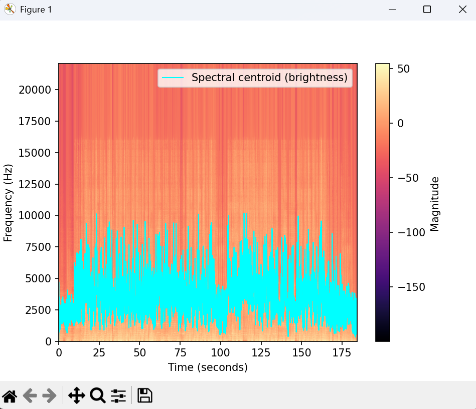

# Audio Spectrum Analyzer

A from-scratch spectrum analyzer that turns an audio file into a visual map of its frequencies over time, and tracks how *bright* the sound is from moment to moment.

It's written in plain Python: the FFT and audio loading are the only library shortcuts — the framing, decibel scaling, spectrogram, and spectral centroid are all implemented by hand, to understand the DSP rather than just call it.

**Example track:** *HOLA* by Bo9al.

## What it does
- Loads a real audio file with `librosa`.
- Splits the signal into 1024-sample frames and runs an FFT on each (`np.fft.rfft`).
- Converts the magnitudes to decibels and stacks the frames into a **spectrogram** — time on the x-axis, frequency (Hz) on the y-axis, energy shown as color.
- Computes the **spectral centroid** (brightness) for every frame and overlays it as a line that rises when the sound brightens and dips when it darkens.

## DSP concepts behind it
- **FFT (Fast Fourier Transform)** — turns a short slice of audio from the time domain into its frequency content.
- **Spectrogram** — many FFT frames placed side by side to show how the frequencies change over time.
- **Decibel scaling** (`20·log10`) — compresses a huge range of magnitudes into a perceptually meaningful scale, closer to how we actually hear loudness.
- **Spectral centroid** — the magnitude-weighted average frequency: a standard "brightness" descriptor used in audio analysis and music information retrieval (MIR).

## A detail it reveals
On an MP3, the spectrogram shows a sharp horizontal edge near 16 kHz. That's the low-pass cutoff the MP3 codec applies during compression — a file-format artifact, not part of the original recording. A small example of reading real meaning out of the picture.

## Screenshot


## How to run
Requires Python 3 and:

```bash
pip install librosa matplotlib numpy
```

Edit the file path inside `librosa.load(...)` to point at your own audio file, then run the script. Save the output plot as `screenshot.png` in this folder so it appears above.
